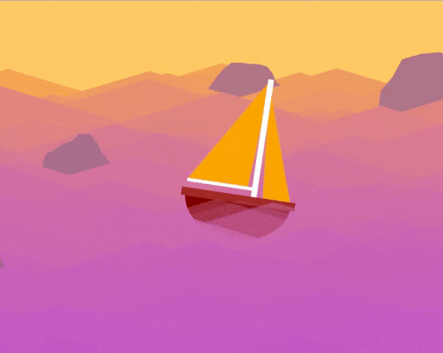
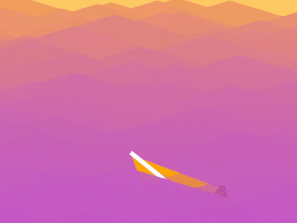
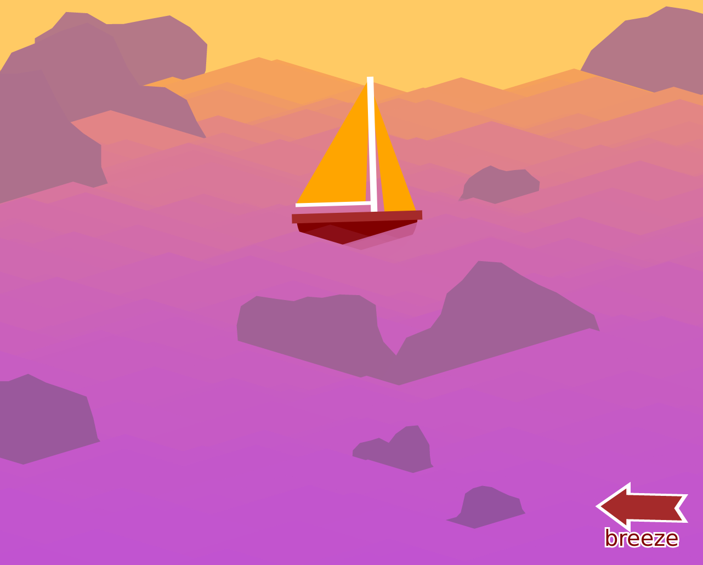
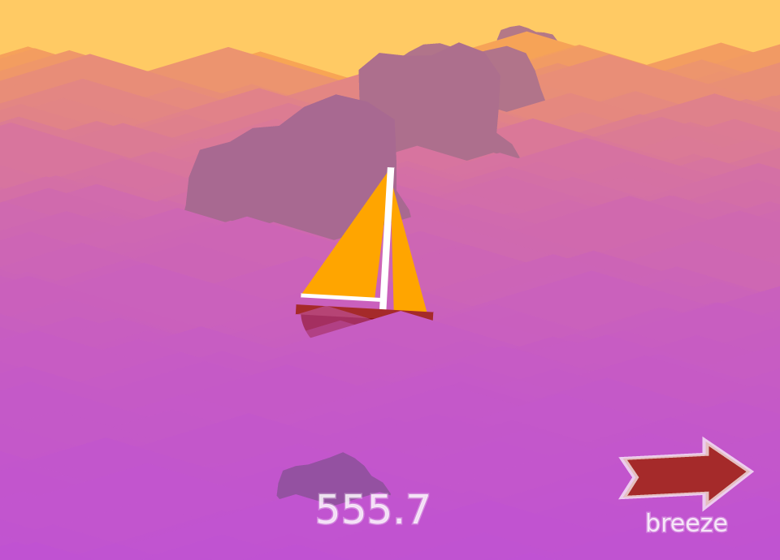

# [Ocean Breeze](https://bdero.itch.io/ocean-breeze)

This project was completed for entry in a [game jam](https://itch.io/jam/qazijam9point5/rate/137952).
I wasn't even sure what the project was going to be until a couple of days in. The code is therefore a huge mess!

## Screenshots

## License

Copyright (C) 2017  Brandon DeRosier

This program is free software: you can redistribute it and/or modify
it under the terms of the GNU General Public License as published by
the Free Software Foundation, either version 3 of the License, or
(at your option) any later version.

This program is distributed in the hope that it will be useful,
but WITHOUT ANY WARRANTY; without even the implied warranty of
MERCHANTABILITY or FITNESS FOR A PARTICULAR PURPOSE.  See the
GNU General Public License for more details.

You should have received a copy of the GNU General Public License
along with this program.  If not, see <http://www.gnu.org/licenses/>.
